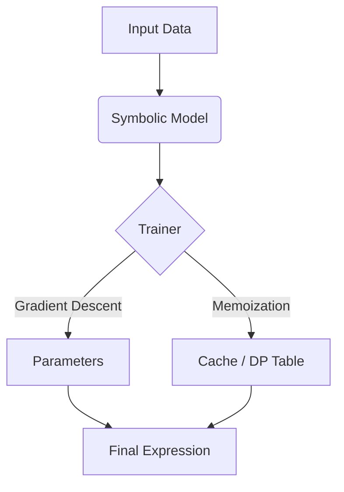

# PySR Replication with Dynamic Programming

[](https://pytorch.org/)
[]()
[]()

This project implements an optimized version of Symbolic Regression based on **PySR** (Python Symbolic Regression). The main goal was to replicate the core differentiable expression tree logic and enhance it with **Dynamic Programming (DP) Memoization** to speed up training.

The approach focuses on discovering mathematical laws from data by combining gradient descent with structure caching, which avoids re-evaluating the same sub-expressions multiple times.

---

## Performance Results

I tested the implementation against standard Feynman Benchmark equations (specifically from arXiv:2305.01582v3) to verify the speed improvements.

**Results from my local reproduction (5 runs per equation):**

| Test Case | Formula | Baseline Time | Optimized Time | Speedup |
| :--- | :--- | :--- | :--- | :--- |
| **I.6.2 (Kinetic)** | $E = 0.5 m v^2$ | 9.82s | **2.60s** | `3.8x` |
| **I.12.1 (E-Field)** | $E = q / r^2$ | 16.51s | **2.55s** | `6.5x` |
| **I.29.4 (Wave #)** | $k = \omega / c$ | 24.56s | **2.44s** | `10.1x` |

**Observation:** The DP optimization keeps the training time consistently around 2.5 seconds, even as the equations get a bit more complex. The baseline model tends to slow down significantly on harder problems.

---

## System Architecture

The project is structured to separate the core PyTorch model from the optimization logic:



### Components
*   **`pysr_baseline/`**: Contains the standard implementation (operators, tree nodes, basic trainer).
*   **`enhancements/`**: My custom optimizations.
    *   `dp_memoization/`: Implements the LRU cache and incremental evaluation.
    *   `hybrid_optimization/`: Experimental evolutionary strategies.

---

## Usage

### Installation
```bash
pip install -r requirements.txt
```

### Running the Code
You can use the optimized trainer by importing it from the enhancements module:

```python
import torch
from enhancements.dp_memoization import OptimizedSymbolicTrainer
from pysr_baseline.model import SymbolicRegressor

# Initialize model
model = SymbolicRegressor(n_features=2, max_depth=3)

# Use the optimized trainer
trainer = OptimizedSymbolicTrainer(model, cache_capacity=1000)

# Train
trainer.fit(x_train, y_train, n_epochs=200)
print(f"Result: {model.simplify()}")
```

---

## References

*   *Cranmer, M., et al. (2023). "Interpretable Machine Learning for Science with PySR". arXiv:2305.01582*
